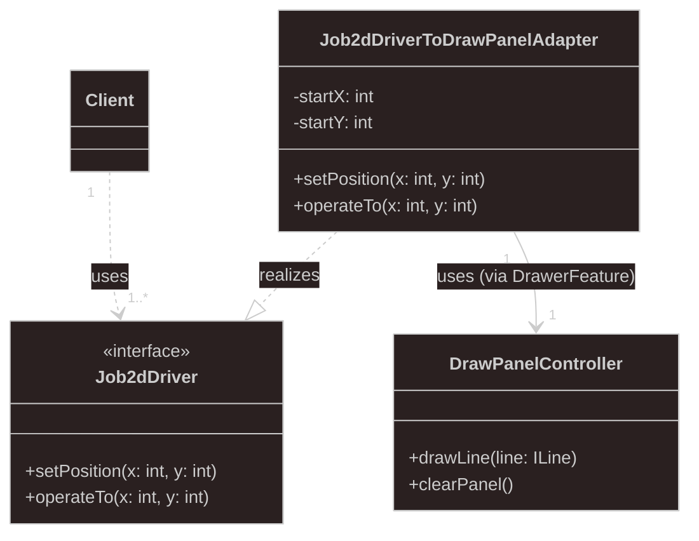

# Laboratoria - zastosowanie wzorców projektowych w bibliotece narzędziowej Jobs2D

## instrukcje

* powp-lab-adapter.pdf - Zapoznanie z projektem i warianty wzorca *adapter*
* powp-lab-command.pdf - Zastosowanie wzorca *command* i innych...

## dokumentacja do bibliotek 

* [Drawer](https://coach.iis.p.lodz.pl/powp-libs-docs/Drawer/)
* [Jobs2dMagic](https://coach.iis.p.lodz.pl/powp-libs-docs/Jobs2dMagic/)
* [PowpAppBase](https://coach.iis.p.lodz.pl/powp-libs-docs/PowpAppBase/)

## ogólne zasady oceny pracy na laboratoriach

Rozwiązanie zadań laboratoryjnych zgłasza się za pomocą Pull Request (PR) oraz za pomocą aktywności wikamp, do której należy dodać link do PR wraz z odpowiedziami na wybrane pytania z instrukcji i diagramami UML (w postaci graficznej). 
Podstawowy czas na wykonanie wszystkich zadań to 7 dni.
Za zgłoszone w terminie rozwiązanie pojedynczej instrukcji można dostać max. 5 pkt. 
Dodatkowe punkty mogą być przyznane za zadania z gwiazdką.
Za każdy tydzień opóźnienia maksymalna liczba punktów zmniejsza się o jeden.
Więcej obowiązujących informacji dotyczących pracy z repozytorium znajduje się w instrukcjach.

### 3.2 - ZAD 4
